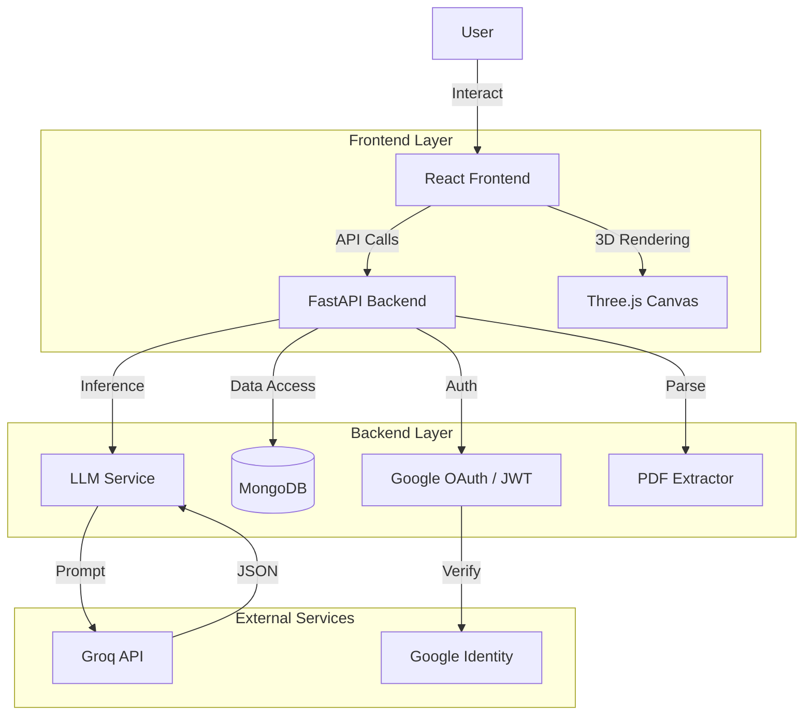
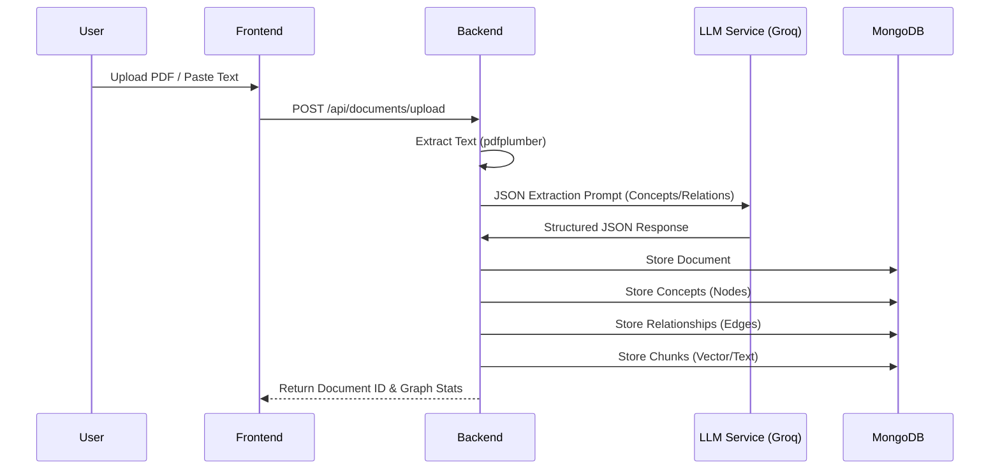
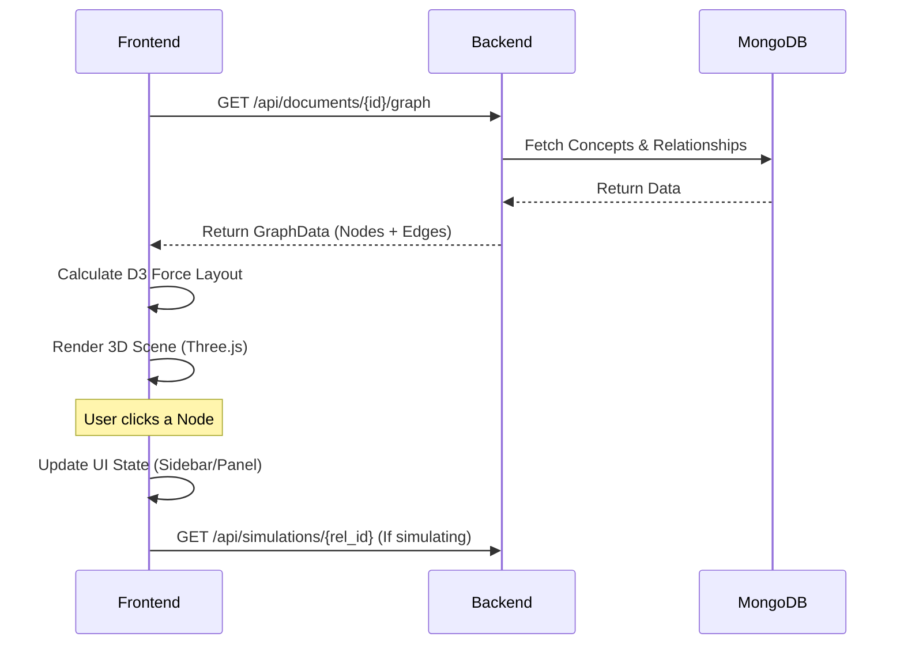
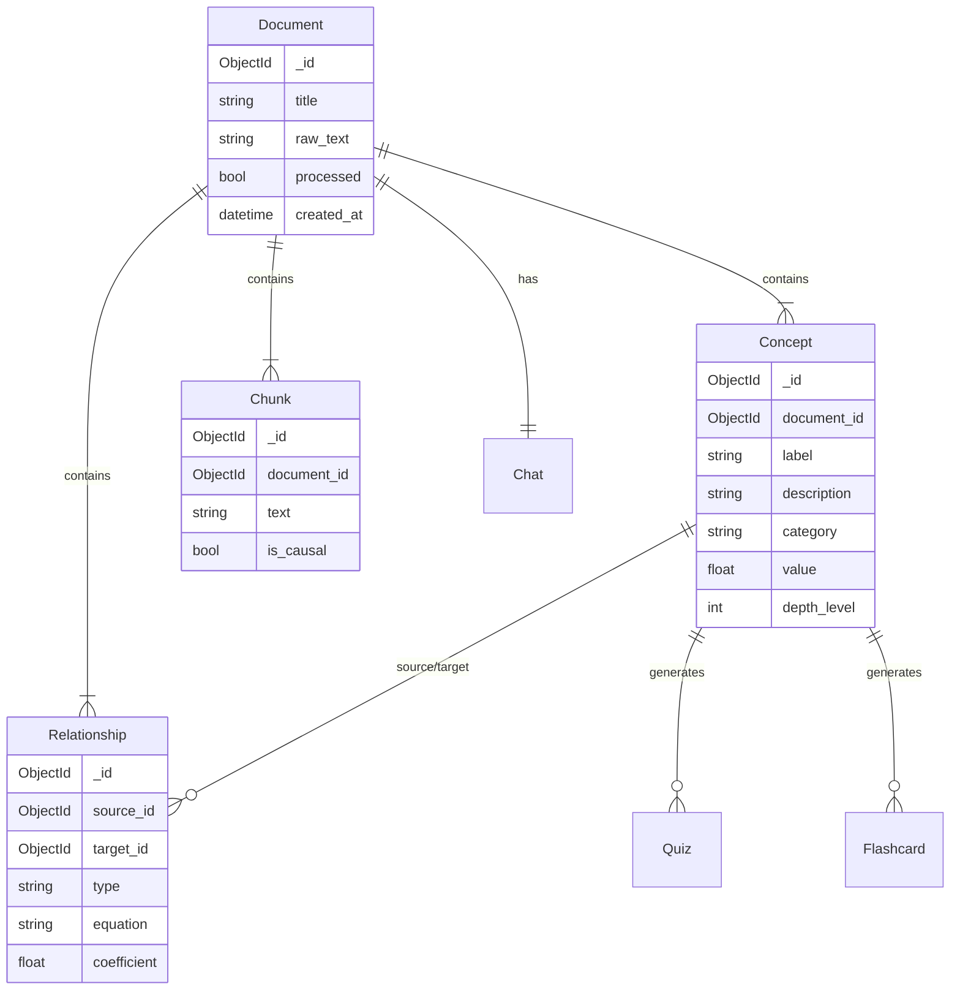

# System Architecture & Documentation

## Overview

**GenZ Pulse** (Synapse) is an interactive knowledge exploration platform that transforms static text (PDFs or raw text) into dynamic, causal 3D knowledge graphs. It allows users to visualize relationships between concepts, simulate changes, and interact with the content through AI-driven chat and quizzes.

## Tech Stack

### Frontend

- **Framework:** React 19 (via Vite)
- **Language:** TypeScript
- **Styling:** Tailwind CSS v4, Lucide React (Icons)
- **Visualization:**
  - **Three.js** (`@react-three/fiber`, `@react-three/drei`) for 3D graph rendering.
  - **D3.js** for force-directed layout algorithms and data calculations.
- **State Management:** React Context API + Local State.
- **Routing:** React Router v7.

### Backend

- **Framework:** FastAPI (Python)
- **Database:** MongoDB (AsyncIO via `motor`)
- **Authentication:** OAuth2 (Google) + JWT
- **AI/LLM Provider:** Groq API (High-performance inference)
- **PDF Processing:** `pdfplumber`
- **Key Libraries:** `pydantic`, `uvicorn`, `python-multipart`

## Application Architecture

### High-Level System Design

## Data Flow

### 1. Document Processing Pipeline

When a user uploads a PDF or pastes text, the following pipeline processes the data:

### 2. Visualization & Interaction

Once processed, the user explores the data structure:

## Database Schema (MongoDB)

The application uses a document-oriented model with these primary collections:

## Core Features Breakdown

### 1. **Causal Graph Generation**

- **Trigger:** Document upload or text paste.
- **Process:** The `llm_service.py` constructs a system prompt for the Groq API to strictly output JSON containing `concepts` (nodes) and `relationships` (edges). It specifically asks for properties like `depth_level` to handle hierarchical zooming (LOD) and `equation` coefficients for simulations.

### 2. **3D Interactive Graph (`ConceptGraph3D.tsx`)**

- **Rendering:** Uses `@react-three/fiber` to render nodes as spheres and edges as lines/arches.
- **Layout:** D3's force simulation runs in the background to calculate stable node positions based on connection density.
- **Parallax & Glow:** Custom shaders and post-processing effects create the "premium" aesthetic with glowing nodes and floating particles.

### 3. **Smart Chat (`ChatPanel.tsx`)**

- **Context:** When a user chats, the system pulls the relevant document context. If a specific node is selected, the context is prioritized around that concept.
- **LLM:** The backend (`chat.py` / `llm_service.py`) acts as an orchestrator, appending the retrieved context to the system prompt before sending the user's query to Groq.

### 4. **Simulations (`simulations.py`)**

- Allows users to change the value of a "Source" node.
- Validates the relationship equation (e.g., `Direct`, `Inverse`, or linear `$y = mx + b$`).
- Propagates changes to connected nodes to visualize "what-if" scenarios.

### 5. **Quiz & Flashcards**

- On-demand generation based on specific concepts.
- `quiz.py` sends the concept context to the LLM to generate 10 structured multiple-choice questions or flashcards.
