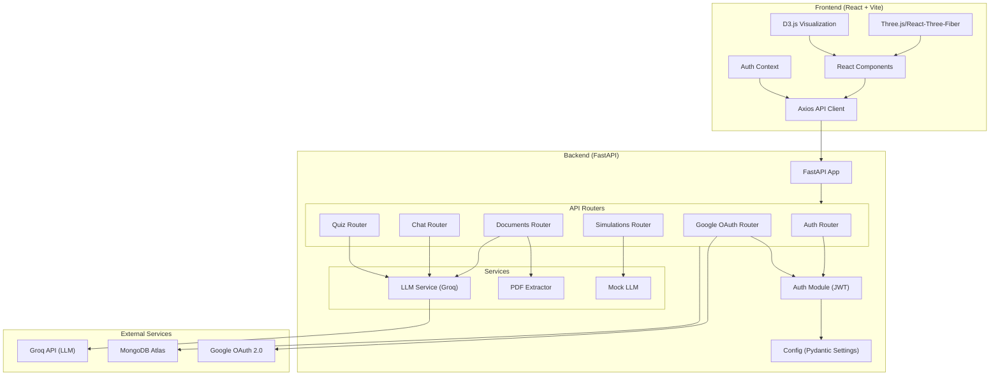
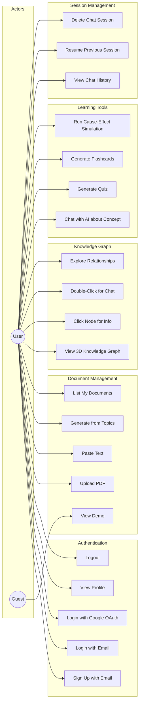
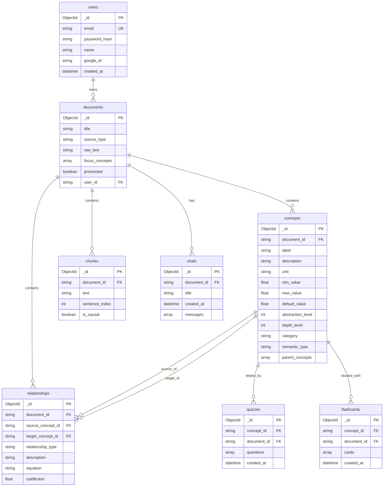
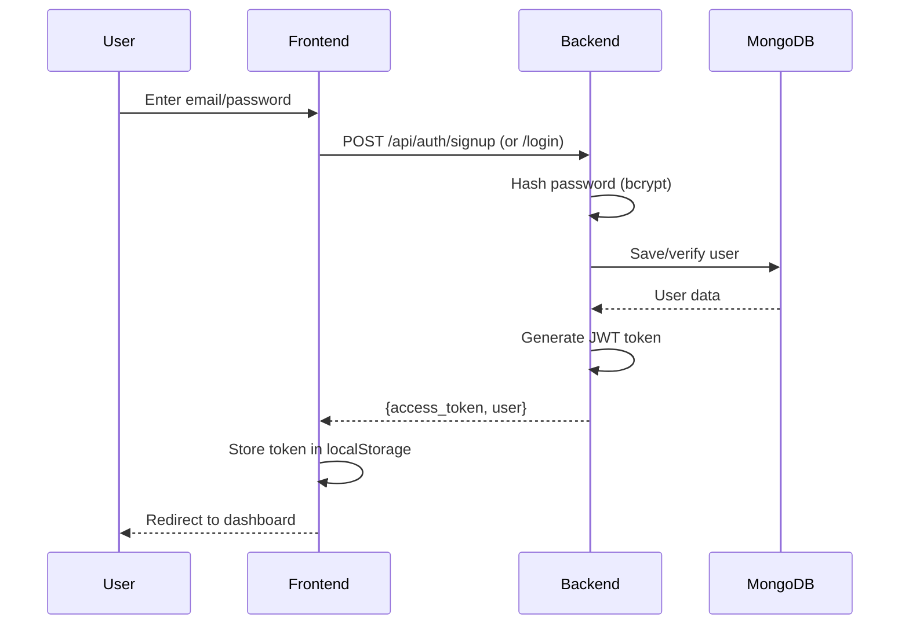
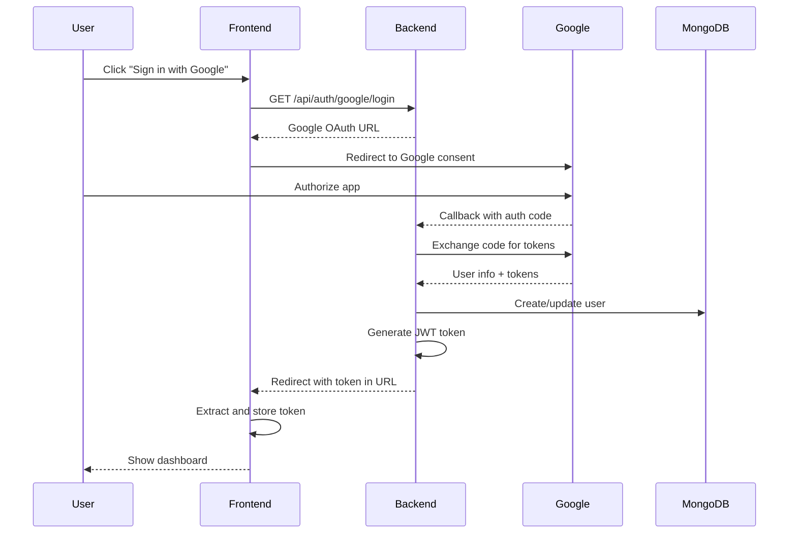

# Synapse - Technical Documentation

> **Synapse** is an AI-powered knowledge graph platform that transforms textbook content into interactive causal structures for enhanced learning.

---

## Table of Contents
1. [Project Overview](#project-overview)
2. [Architecture Diagram](#architecture-diagram)
3. [Use Case Diagram](#use-case-diagram)
4. [Technology Stack](#technology-stack)
5. [Backend Architecture](#backend-architecture)
6. [Frontend Architecture](#frontend-architecture)
7. [Data Models](#data-models)
8. [API Reference](#api-reference)
9. [Authentication Flow](#authentication-flow)
10. [File Structure](#file-structure)

---

## Project Overview

**Synapse** is a full-stack educational platform that:
- Extracts causal relationships from PDF documents or pasted text
- Generates interactive 3D knowledge graphs
- Provides AI-powered contextual chat about concepts
- Generates quizzes and flashcards for learning reinforcement
- Simulates cause-effect relationships between concepts

---

## Architecture Diagram



---

## Use Case Diagram



---

## Technology Stack

### Backend
| Technology | Purpose |
|------------|---------|
| **FastAPI** | Web framework with async support |
| **Python 3.x** | Backend language |
| **Motor** | Async MongoDB driver |
| **Pydantic** | Data validation/settings |
| **PyJWT** | JWT authentication |
| **Groq API** | LLM inference (Llama models) |
| **PyMuPDF** | PDF text extraction |
| **Passlib + Bcrypt** | Password hashing |

### Frontend
| Technology | Purpose |
|------------|---------|
| **React 19** | UI framework |
| **Vite 7** | Build tool |
| **TypeScript** | Type-safe JavaScript |
| **Tailwind CSS 4** | Styling |
| **React-Three-Fiber** | 3D visualization |
| **D3.js** | Graph visualization |
| **Axios** | HTTP client |
| **React Router 7** | Client-side routing |
| **Lucide React** | Icons |

### Infrastructure
| Technology | Purpose |
|------------|---------|
| **MongoDB Atlas** | Cloud database |
| **Google OAuth 2.0** | Social authentication |
| **Docker** | Containerization |
| **Vercel** | Frontend deployment |
| **Cloud Run** | Backend deployment |

---

## Backend Architecture

### Directory Structure
```
backend/
├── main.py              # FastAPI app entry point
├── config.py            # Pydantic settings configuration
├── database.py          # MongoDB connection (Motor)
├── models.py            # Pydantic data models
├── auth.py              # JWT authentication utilities
├── requirements.txt     # Python dependencies
├── Dockerfile           # Container configuration
├── routers/
│   ├── auth.py          # Email signup/login
│   ├── google_oauth.py  # Google OAuth flow
│   ├── documents.py     # Document upload/processing
│   ├── chat.py          # AI chat endpoint
│   ├── quiz.py          # Quiz & flashcard generation
│   └── simulations.py   # Cause-effect simulations
└── services/
    ├── llm_service.py   # Groq LLM integration
    ├── mock_llm.py      # Mock data & demo content
    └── pdf_extractor.py # PDF text extraction
```

### Core Modules

#### main.py
FastAPI application with:
- CORS middleware configuration
- MongoDB lifecycle management
- Router registration for all API endpoints
- Health check endpoint

#### config.py
Pydantic settings for:
- MongoDB connection (`MONGO_URI`, database name)
- JWT configuration (secret, algorithm, expiry)
- Groq API key
- Google OAuth credentials
- CORS origins

#### database.py
Async MongoDB connection using Motor driver with:
- Connection pooling
- Graceful shutdown handling

---

## Frontend Architecture

### Directory Structure
```
frontend/src/
├── App.tsx                  # Main app component with routing
├── main.tsx                 # React entry point
├── index.css                # Global styles
├── api/
│   └── client.ts            # Axios API client with auth interceptors
├── components/
│   ├── AuthPage.tsx         # Login/Signup forms
│   ├── GoogleCallback.tsx   # OAuth callback handler
│   ├── Sidebar.tsx          # Navigation sidebar
│   ├── DocumentUpload.tsx   # PDF/text upload interface
│   ├── KnowledgeGraphPage.tsx    # Main graph view
│   ├── ConceptGraph3D.tsx   # 3D Three.js graph
│   ├── EnhancedConceptGraph.tsx  # D3 2D graph
│   ├── ChatPanel.tsx        # AI chat interface
│   ├── RightPanel.tsx       # Info/exploration panel
│   ├── ExplorePanel.tsx     # Concept exploration
│   ├── SimulationPanel.tsx  # Cause-effect simulator
│   ├── QuizDialog.tsx       # Quiz interface
│   ├── FlashcardDialog.tsx  # Flashcard interface
│   └── ui/                  # Reusable UI components
├── context/
│   └── AuthContext.tsx      # Authentication state management
├── types/
│   └── index.ts             # TypeScript interfaces
└── lib/
    └── utils.ts             # Utility functions
```

---

## Data Models

### MongoDB Collections



---

## API Reference

### Authentication Endpoints

| Method | Endpoint | Description | Auth |
|--------|----------|-------------|------|
| `POST` | `/api/auth/signup` | Register new user | No |
| `POST` | `/api/auth/login` | Email/password login | No |
| `GET` | `/api/auth/profile` | Get current user | Yes |
| `GET` | `/api/auth/google/login` | Get Google OAuth URL | No |
| `GET` | `/api/auth/google/callback` | Handle OAuth callback | No |

### Document Endpoints

| Method | Endpoint | Description | Auth |
|--------|----------|-------------|------|
| `POST` | `/api/documents/upload` | Upload PDF | Yes |
| `POST` | `/api/documents/paste` | Submit pasted text | Yes |
| `POST` | `/api/documents/generate` | Generate from topics | Yes |
| `POST` | `/api/documents/demo` | Create demo document | Optional |
| `GET` | `/api/documents/` | List user's documents | Yes |
| `GET` | `/api/documents/{id}` | Get document details | Yes |
| `GET` | `/api/documents/{id}/graph` | Get knowledge graph | Yes |

### Chat Endpoints

| Method | Endpoint | Description | Auth |
|--------|----------|-------------|------|
| `POST` | `/api/chat/message` | Send chat message | Yes |
| `GET` | `/api/chat/history` | Get chat sessions | Yes |
| `GET` | `/api/chat/{id}` | Get chat session | Yes |
| `DELETE` | `/api/chat/{id}` | Delete chat session | Yes |

### Quiz Endpoints

| Method | Endpoint | Description | Auth |
|--------|----------|-------------|------|
| `POST` | `/api/quiz/generate` | Generate quiz for concept | Yes |
| `POST` | `/api/quiz/flashcards/generate` | Generate flashcards | Yes |

### Simulation Endpoints

| Method | Endpoint | Description | Auth |
|--------|----------|-------------|------|
| `GET` | `/api/simulations/{relationship_id}` | Get simulation config | Yes |
| `POST` | `/api/simulations/calculate` | Calculate simulation | Yes |

---

## Authentication Flow

### Email Authentication


### Google OAuth


---

## File Structure

```
knowledge_web_043/
├── .env                     # Environment variables
├── .gitignore               # Git ignore rules
├── README.md                # Project readme
├── ARCHITECTURE.md          # Architecture docs
├── DEPLOYMENT.md            # Deployment guide
├── VERCEL_DEPLOYMENT.md     # Vercel-specific guide
│
├── backend/
│   ├── main.py              # FastAPI entry point
│   ├── config.py            # Settings configuration
│   ├── database.py          # MongoDB connection
│   ├── models.py            # Pydantic models
│   ├── auth.py              # JWT auth utilities
│   ├── requirements.txt     # Python dependencies
│   ├── Dockerfile           # Backend container
│   ├── routers/             # API route handlers
│   └── services/            # Business logic
│
└── frontend/
    ├── index.html           # HTML entry
    ├── package.json         # Node dependencies
    ├── vite.config.ts       # Vite configuration
    ├── tsconfig.json        # TypeScript config
    ├── vercel.json          # Vercel deployment
    ├── Dockerfile           # Frontend container
    └── src/                 # React source code
```

---

## Environment Variables

| Variable | Description | Required |
|----------|-------------|----------|
| `MONGO_URI` | MongoDB connection string | Yes |
| `JWT_SECRET_KEY` | Secret for JWT signing | Yes |
| `GROQ_API_KEY` | Groq API key for LLM | Yes |
| `GOOGLE_CLIENT_ID` | Google OAuth client ID | Yes |
| `GOOGLE_CLIENT_SECRET` | Google OAuth secret | Yes |
| `GOOGLE_REDIRECT_URI` | OAuth callback URL | Yes |
| `CORS_ORIGINS` | Allowed frontend origins | Yes |
| `FRONTEND_URL` | Frontend URL for redirects | Yes |

---

## Running Locally

### Backend
```bash
cd backend
python -m venv .venv
.venv\Scripts\activate  # Windows
pip install -r requirements.txt
uvicorn main:app --reload --port 8000
```

### Frontend
```bash
cd frontend
npm install
npm run dev
```

Access the application at `http://localhost:5173`

---

*Documentation generated on 2026-01-24*
